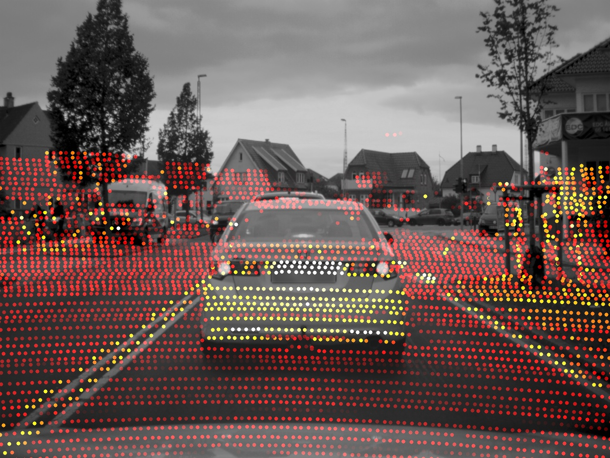

# Coding challenge: Camera projection of Lidar points
Today's the kick-off of your coding challenge!

We recommend to use either Python or C++ and the 'usual suspects' of libraries, but you may use any programming language and additional libraries of your choice. 

Thank you! We are super excited for your results!

## Task
The task is simple: Given a 3D point cloud (captured from a Velodyne Lidar scanner mounted on top of the roof of one of our development vehicles) and the matching front camera image, overlay the 3D Lidar points into the 2D camera image(assuming a pinhole camera model).

Together with this readme you received three files:

1) camera_image.jpeg: The front camera image. 
2) point_cloud.csv: The Velodyne point cloud as comma-seperated text file.
3) camera_calib.json: Calibration parameters (intrinsic, extrinsic) of the camera with regard to the vehicle coordinate system.

We recommend using C++ and the 'usual suspects' of libraries, but you may use any programming language and additional libraries of your choice. Feel free to hard-code the camera calibration (e.g. as defines) instead of reading them from the JSON file.

Please provide us with your runnable code and the build instructions so that we can reproduce your results. 

If you did it correctly, the result may look like this (note that the points here are colored by intensity, but you may also use distance scaling):

## Point cloud
The point cloud comes as a comma-separated value. Each Lidar point has four attributes: x/y/z cartesian coordinates and intensity (a measure of reflectivity of the surface which reflected the laser pulse).
The .csv file has one row per attribute:

x_1, x_2, x_3, ..., x_n

y_1, y_2, y_3, ..., y_n

z_1, z_2, z_3, ..., z_n

in_1, in_2, in_3, ..., in_n

## Reference vehicle coordinate system
Point cloud and camera mounting position are in reference to the vehicle coordinate system ("body frame"):

## Camera calibration data
Camera calibration data is provided in a .json file with the following fields:

| Field                 | Description |
| ----------------------|:--------------------------------------------------
| camera_x_m            | Camera x mounting position in m                   |
| camera_y_m            | Camera y mounting position in m                   |
| camera_z_m            | Camera z mounting position in m                   |
| camera_roll_rad       | Camera roll in radians                            |
| camera_pitch_rad      | Camera pitch in radians                           |
| camera_yaw_rad        | Camera yaw in radians                             |
| camera_focal_len_m    | Camera focal length in m                          |
| camera_pixel_dim_m    | Camera pixel dimensions in m                      |
| camera_size_u_px      | Camera image sensor size (horizontal) in pixels   |
| camera_size_v_px      | Camera image sensor size (vertical) in pixels     |

